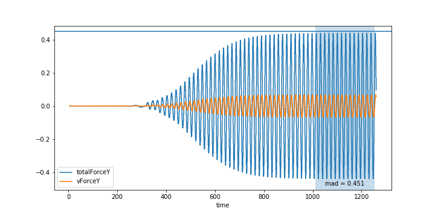
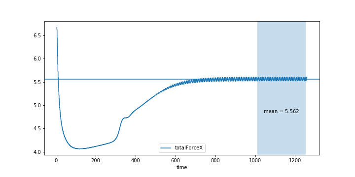

# LotusStat
__Statistical post processing of Lotus simulations__


  | 
:-------------:|:--------------:

# Installation

1. Clone repository
2. Navigate to `...\LotusStat\`
3. Install the package `python setup.py install`

# Quick example

Also found in `...\LotusStat\examples\quick_examply.py`

```python
import lotusstat as lstat
import matplotlib.pyplot as plt

data_path = 'fort.9'

data_df = lstat.convert_data_path_to_dataFrame_2d(data_path)
data_df = data_df.iloc[500:,:]

data_df = lstat.calculate_total_forces(data_df)

lift_stats = lstat.calculate_signal_stats(data_df, 'totalForceY', signal_range=(0.8, 1))
drag_stats = lstat.calculate_signal_stats(data_df, 'totalForceX', signal_range=(0.8, 1))

fig1, ax1 = lstat.plot_lift_signal(data_df, show_visc=True, plot_stats=True, stats=lift_stats, show_stats=True, figsize=(10,5))
fig2, ax2 = lstat.plot_drag_signal(data_df, show_visc=False, plot_stats=True, stats=drag_stats, show_stats=True, figsize=(10,5))
plt.close()
plt.close()

lstat.save_figures_to_pdf([fig1, fig2], 'report.pdf')

```
